# Project 3 - Spotify 2023

[Link to the dashboard](https://app.powerbi.com/view?r=eyJrIjoiNjgxMTFlYjctMDRmZi00NzliLTgyN2EtY2NiZGU0ZDQxODU2IiwidCI6ImRiZDY2NjRkLTRlYjktNDZlYi05OWQ4LTVjNDNiYTE1M2M2MSIsImMiOjl9&pageName=ReportSection)

[Link to the dataset](https://www.kaggle.com/datasets/nelgiriyewithana/top-spotify-songs-2023/data)

***This project is a Power BI dashboard to showcase different KPIs about the most streamed Spotify songs for 2023***

***Here are the different measures created for this project***

* Date :
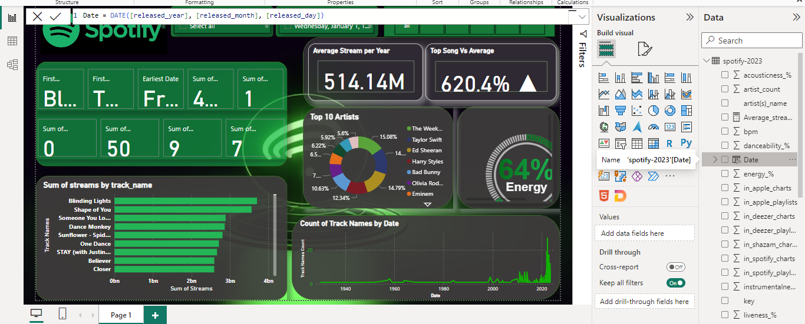

* Average Streams per year :
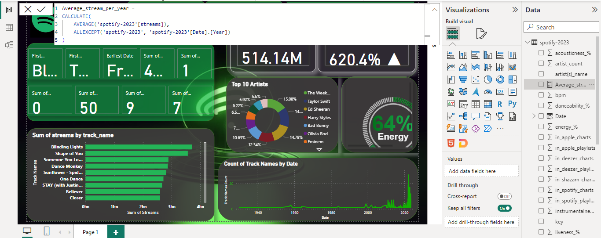

* Maximum of streams :
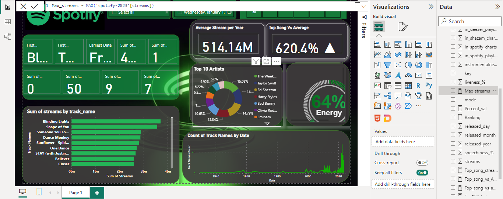

* Average Percentage of energy in each song :
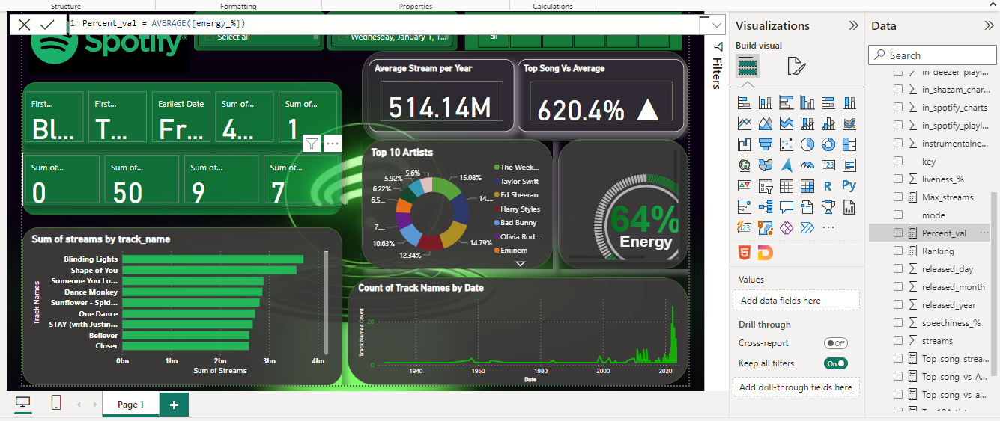

* Ranking Artists by Streams :
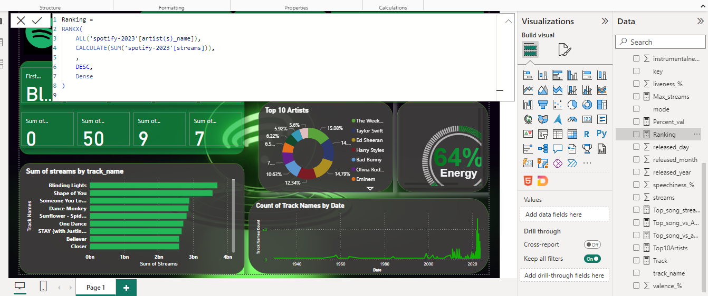

* Number of streams for the top song :
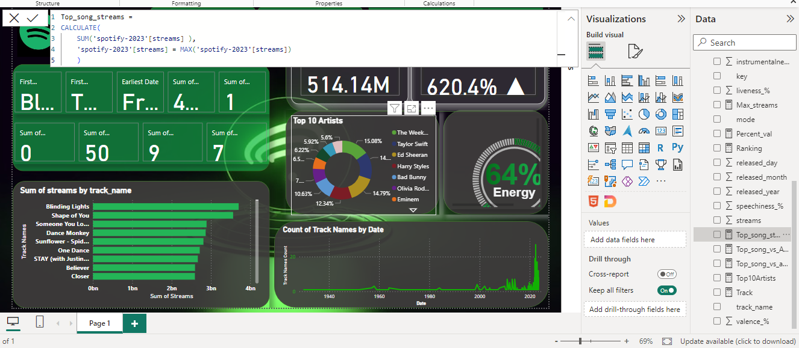

* Top song streams value VS Average streams per year:
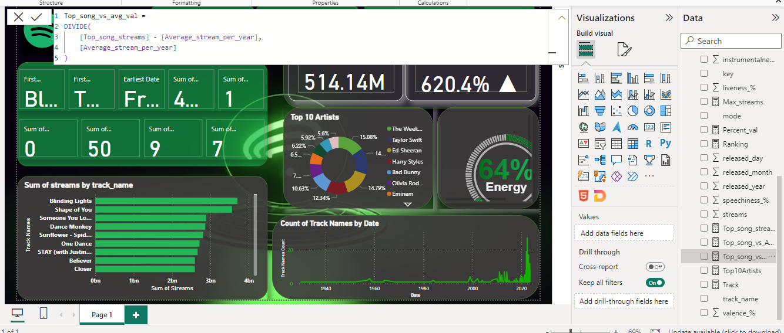
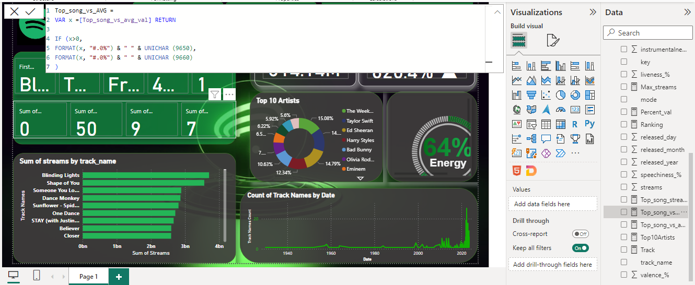

* Top 10 artists by streams:
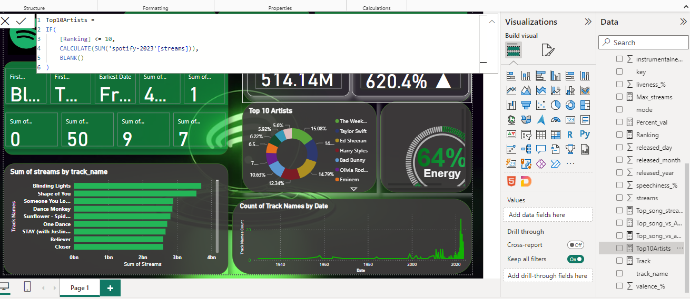

* Count Track names:
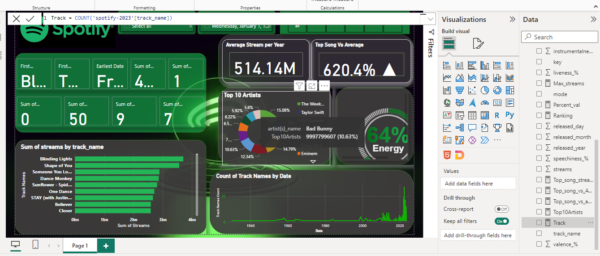

***Dashboard***
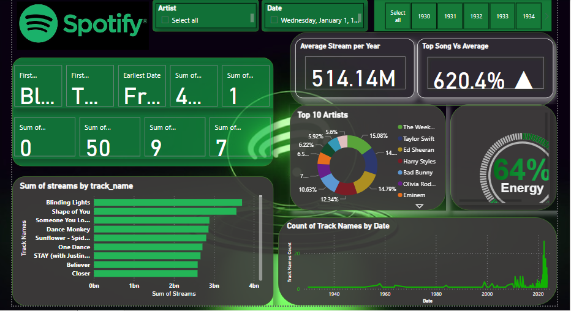
